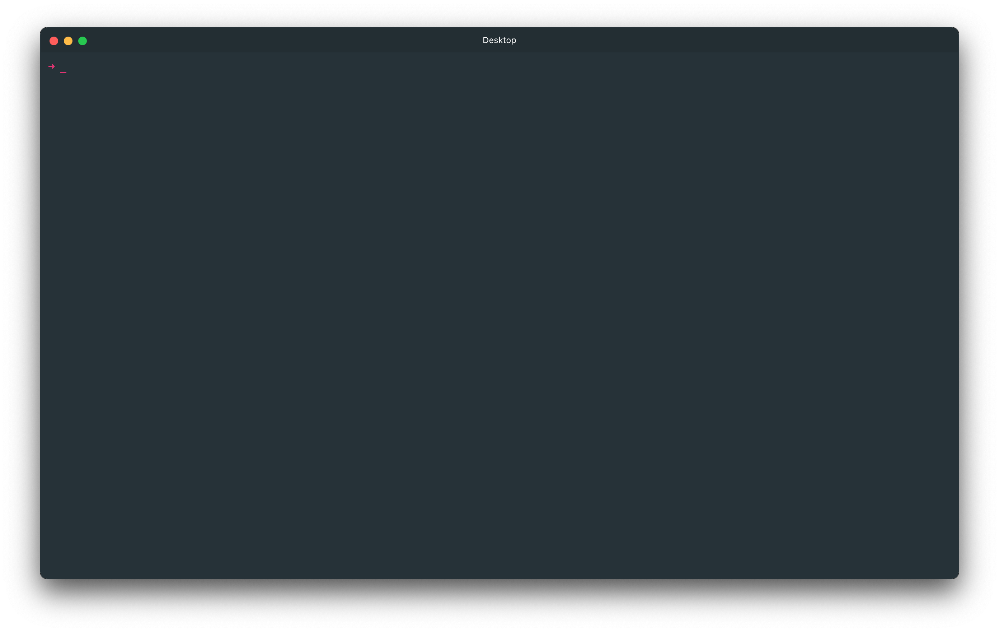

# Atom Material Theme for Hyper Terminal

> This Theme based on [atom-material-ui](https://github.com/atom-material/atom-material-ui) and [atom-material-syntax](https://github.com/atom-material/atom-material-syntax)



## Installation

```zsh
$ hyper install hyper-theme-atom-material
```